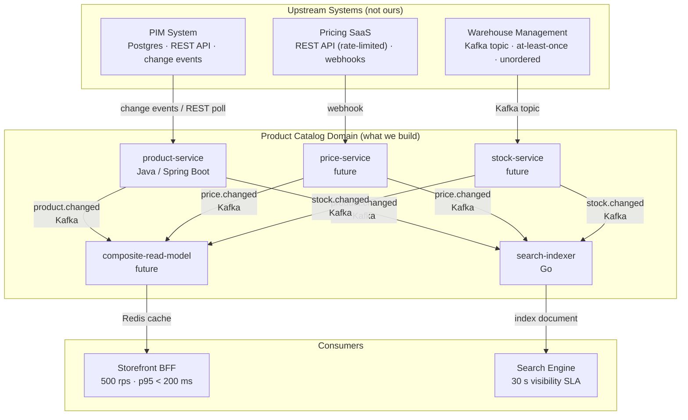
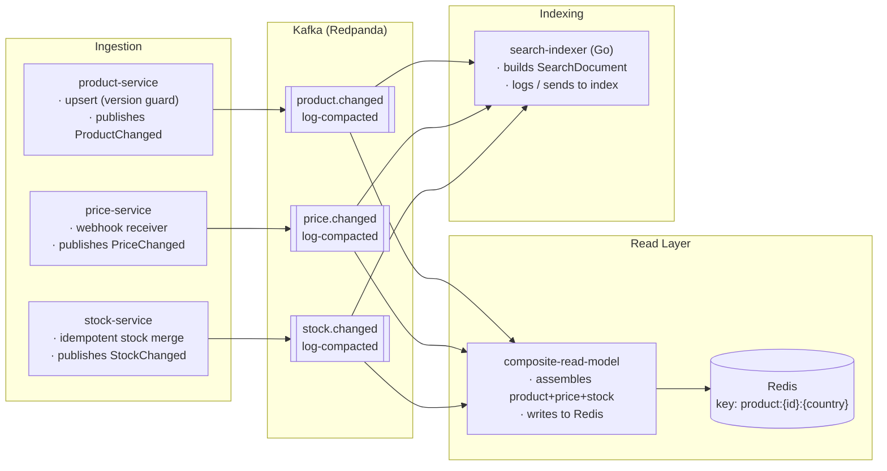
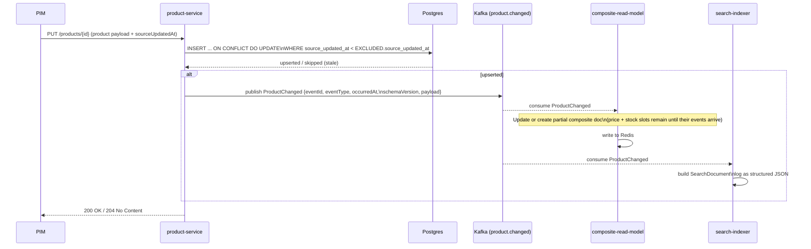
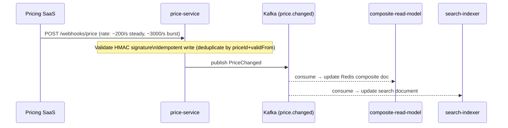
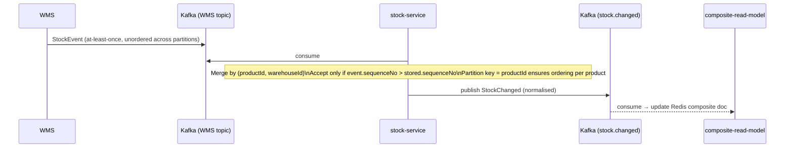
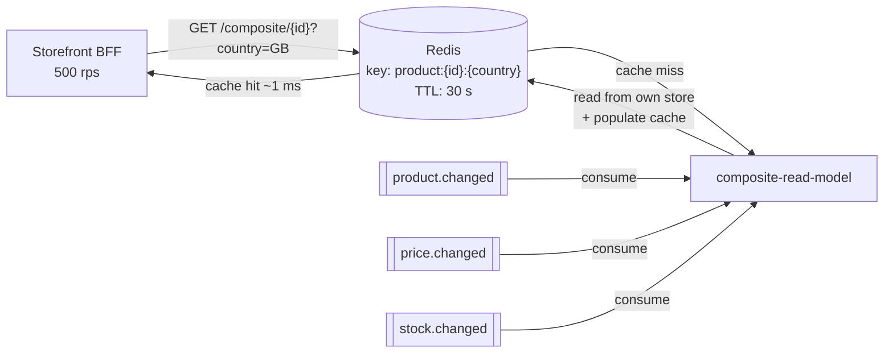

# Architecture — Product Catalog Platform

## Phase 0 Decisions (locked in)

| Decision | Choice | One-line rationale |
|---|---|---|
| Persistence | Postgres | Idempotent upsert with version guard via `ON CONFLICT`; already provided |
| Transport | Kafka (Redpanda) | Decoupled fan-out, replay for index rebuild, matches company event-driven default |
| BFF read shape | Composite read model | Single hop, cacheable; 3 parallel fan-out calls can't reliably hit p95 < 200 ms |
| Product control fields | See §3 | status, country, version, sourceUpdatedAt, createdAt, updatedAt |

---

## 1. System Context

What we own versus what we integrate with.

---

## 2. Component Map

Shows the internal structure of the Product Catalog domain — the services we own, the Kafka topics that connect them, and the two read paths (BFF and search). The three ingestion services (product, price, stock) each own one domain and publish normalised events to their respective log-compacted topics. The read layer (composite-read-model + Redis) serves the latency-sensitive BFF. The search-indexer consumes all three topics independently and builds search documents for the index. Services in grey are design only and not implemented in this exercise.

> **Scope of this exercise:** `product-service` and `search-indexer` are implemented.
> `price-service`, `stock-service`, and `composite-read-model` are design only.

---

## 3. Product Model

### Control fields and their justification

| Field | Type | Why it belongs |
|---|---|---|
| `id` | `UUID` | Stable identity; generated by us, not inherited from PIM (PIM ids change on re-import) |
| `name` | `String` | Minimal descriptive field per brief |
| `status` | `Enum` (`ACTIVE`, `INACTIVE`, `DISCONTINUED`) | Drives whether product is surfaced to BFF or indexed; brief explicitly lists it |
| `country` | `String` (ISO 3166-1 alpha-2) | 2M SKUs across 8 countries; without this, reads and events cannot be scoped per market |
| `version` | `Long` | Optimistic concurrency — prevents a stale bulk import (100k burst) overwriting a fresher editorial change |
| `sourceUpdatedAt` | `Instant` | Timestamp from PIM — the guard condition on upsert: reject if `sourceUpdatedAt <= existing.sourceUpdatedAt` |
| `createdAt` | `Instant` | System audit; used by indexer to signal new vs. updated documents |
| `updatedAt` | `Instant` | System audit; cache invalidation signal |

### Fields deliberately excluded

| Field | Reason |
|---|---|
| `color`, `brand`, `userType` | Descriptive attributes — brief says `id` and `name` are the only descriptive fields needed; adding more is out of scope |
| `price` | Separate domain with its own upstream, service, and event stream; embedding it here violates domain boundaries |
| `rating` | Derived/computed from reviews; not owned by PIM; separate domain |

---

## 4. Data Flows

### 4a. Product path (implemented)

**Idempotency note:** The `ON CONFLICT` guard on `sourceUpdatedAt` means replaying the same event twice is safe. The indexer consuming the same Kafka message twice is also safe — it builds and logs the same document.

**Outbox trade-off:** After the DB commit, the service publishes directly to Kafka. If the process crashes between commit and publish, the event is lost (at-most-once delivery to Kafka). The correct solution is the [Transactional Outbox pattern](https://microservices.io/patterns/data/transactional-outbox.html) — write the event to an `outbox` table in the same DB transaction, relay asynchronously. This is noted as a "what I'd do next" item; direct publish is acceptable for this exercise.

---

### 4b. Price path (design only)

**Burst handling:** At 3,000/s, Kafka absorbs the burst without back-pressure on the SaaS. The webhook receiver only writes to Kafka; downstream consumers process at their own pace.

**Rate limit concern:** If the SaaS REST API is needed for backfill (not just webhooks), the rate limit matters. Cache aggressively; only poll for products whose webhook was missed (dead-letter reconciliation).

---

### 4c. Stock path (design only)

**Ordering problem:** WMS publishes with no ordering guarantee across partitions. Partitioning `stock.changed` by `productId` ensures all events for a product are ordered within `stock-service`. For cross-partition replays, a `sequenceNo` (from WMS) is used as a guard — same principle as `sourceUpdatedAt` on products.

---

## 5. BFF Read Path

**Latency model:**
- Cache hit: BFF → Redis → BFF ≈ 1–5 ms. p95 < 200 ms easily met.
- Cache miss: BFF → composite-read-model → its own DB → Redis → BFF ≈ 20–50 ms. Still fine.
- Cache TTL of 30 s is a reasonable default; stock changes frequently so we accept up to 30 s staleness on stock data for BFF. Price and product can have longer TTLs (5 min).

**Partial data problem:** If the composite doc is assembled before price or stock has arrived (e.g. new product just created), the read model writes a partial document and updates it as each domain event arrives. The BFF receives whatever is current. Missing price → BFF shows "price unavailable". Missing stock → BFF shows "out of stock". This is preferable to blocking the read until all three are present.

---

## 6. Index Rebuild Strategy

**Requirement:** Rebuild from scratch within 1 hour without taking the site down.

**Mechanism: Log-compacted Kafka topics**

All three domain topics (`product.changed`, `price.changed`, `stock.changed`) are configured as **log-compacted**. Kafka retains the latest message per key (by `productId`). This means the topic always contains the current state of every product — it is a durable, replayable snapshot.

**Rebuild procedure:**
1. Spin up a new indexer consumer group (separate from the live one).
2. Set offset to `earliest`.
3. Consume all messages — Kafka delivers only the latest per key due to compaction.
4. New indexer writes to a **new index alias** (blue/green index swap).
5. Once caught up to live offset, atomically point the search engine alias at the new index.
6. Decommission the old index.

**Scale check:**
- 2M products × ~1 KB avg message ≈ 2 GB on topic
- At 50 MB/s consumer throughput ≈ 40 seconds to consume all messages
- Well within the 1-hour SLA, with headroom for price and stock topics

**Live indexer is unaffected** — it runs as its own consumer group and continues writing to the live index throughout.

---

## 7. Architecture Decision Records

### ADR-001 — Kafka as transport between services

**Status:** Accepted

**Context:** Product-service needs to notify downstream consumers (indexer, future composite-read-model) when a product is created or updated. Options: synchronous HTTP callbacks, or async Kafka events.

**Decision:** Kafka (Redpanda locally).

**Consequences:**
- (+) Decoupled — consumers can be down and catch up on restart
- (+) Fan-out — add consumers without changing the producer
- (+) Log compaction enables index rebuild for free
- (+) Matches company's stated event-driven default
- (-) At-least-once delivery — consumers must be idempotent
- (-) Harder to debug than HTTP (mitigated by Redpanda Console)

---

### ADR-002 — Log-compacted topics for durable state

**Status:** Accepted

**Context:** The search index must be rebuildable within 1 hour. Options: full DB scan via a batch job, separate snapshot API, or log-compacted Kafka topics.

**Decision:** Configure all domain topics as log-compacted.

**Consequences:**
- (+) Index rebuild is just "replay the topic" — no special rebuild endpoint needed
- (+) Compacted topic = latest state per key = equivalent to a full snapshot at zero extra cost
- (+) No TTL risk — compacted topics retain data indefinitely (by key, not by time)
- (-) Compaction is asynchronous; very recent messages may not yet be compacted (tolerable — live consumer group covers the gap)

---

### ADR-003 — Composite read model for BFF

**Status:** Accepted

**Context:** BFF needs product + price + stock in a single response at 500 rps / p95 < 200 ms. Options: BFF fans out to three services, or a composite read model pre-assembles the document.

**Decision:** Composite read model backed by Redis.

**Consequences:**
- (+) Single network hop from BFF; p95 < 200 ms is trivially achievable
- (+) Redis cache absorbs read traffic; domain services are not on the critical path
- (-) Additional service to build (not in scope for this exercise)
- (-) Eventual consistency — composite doc lags domain events by up to seconds
- (-) "Event arrives before product exists" edge case must be handled (partial document, filled in as subsequent events arrive)

---

### ADR-004 — Direct publish vs. transactional outbox

**Status:** Accepted (with noted limitation)

**Context:** After a product upsert is committed to Postgres, an event must be published to Kafka. If the service crashes between DB commit and Kafka publish, the event is silently lost.

**Decision:** For this exercise, publish directly post-commit. Document the gap.

**What production requires:** Transactional Outbox — write the event to an `outbox` table in the same DB transaction, then a relay process (Debezium CDC or a polling relay) reads the outbox and publishes to Kafka. This gives exactly-once DB write + at-least-once Kafka delivery with no silent loss.

**Consequences of direct publish:**
- (+) Simpler code; no outbox table or relay process
- (-) At-most-once Kafka delivery (event lost on crash between commit and publish)
- (-) PIM re-emitting the change event is the recovery path — acceptable if PIM is reliable; not acceptable if it is not

---

## 8. What Is Not Built (and Why)

| Item | Why omitted |
|---|---|
| `price-service` | Design only per brief. The interesting work (rate-limit handling, webhook dedup) is documented in §4b. |
| `stock-service` | Design only per brief. Ordering and idempotency are documented in §4c. |
| Composite read model | Not required; BFF read path is design only. |
| Transactional outbox | Correct production approach but adds scope; documented in ADR-004. |
| Schema registry | Would version `ProductChanged` event contract. Worth adding; not worth the time here. |
| Auth / pagination / CI/CD | Explicitly out of scope per brief. |
| Real search engine (Elasticsearch / OpenSearch) | Explicitly out of scope per brief; indexer logs the document instead. |
